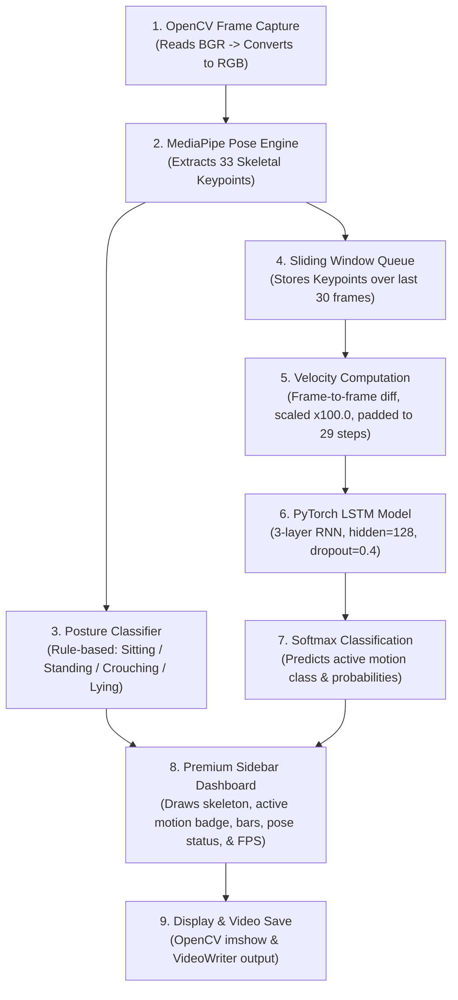

# HRI Human Motion Recognizer (Upgraded PyTorch LSTM)

A real-time deep learning pipeline that classifies human motion trajectories and body postures in Human-Robot Interaction (HRI) scenarios. The system processes video streams (webcam or video files), extracts skeletal keypoints using MediaPipe, and evaluates temporal sequences using a trained PyTorch LSTM network.

This module has been upgraded to support the new **HRI Dataset Table** scenarios, expanding from the older synthetic motions to a refined 9-class movement taxonomy optimized for human intent recognition in Classroom and Kitchen environments.

---

## 📋 Project Overview

### **Objective**
To develop a high-precision, real-time HRI monitoring system capable of understanding:
1. **Pose:** Physical posture (e.g., "Sitting", "Standing", "Leaning") evaluated frame-by-frame.
2. **Motion:** Directional trajectory and velocity in 3D relative to the camera (e.g., "Walk Toward", "Step/Walk Back", "Walk Across", "Run Backward", "Run", "Frozen/Rigid Stand").

These motion cues represent the **Motion** component of the **4-Cue HRI Framework** (Emotion + Gesture + Motion + Context), which fuse together to predict the user's intent.

---

## 🔄 System Flow & Pipeline

The diagram below details the 5 consecutive stages that every video frame goes through in real time:



---

## 📊 HRI Scenario Motion Taxonomy

The upgraded motion recognition module supports **9 motion classes** mapping directly to the scenarios defined in the HRI Dataset Table:

| Class ID | Upgraded Motion Class | Scenario Behavior | Scenarios Using It (Classroom & Kitchen) |
| :---: | :--- | :--- | :--- |
| **0** | **Sitting Still** | Seated, minimal movement | #1, #3, #4, #7, #11, #12, #14, #21, #28, #33 |
| **1** | **Standing Still** | Standing, natural posture | #5, #9, #18, #22, #24, #35, #36, #37, #38 |
| **2** | **Walk Toward** | Normal pace approach (Z increases) | #2, #16, #20, #29 |
| **3** | **Step/Walk Back** | Walking/stepping backward (Z decreases) | #6, #23, #26, #27 |
| **4** | **Walk Across** | Lateral walking movement (X changes) | #8, #17, #25 |
| **5** | **Run Backward** | Fast backward retreat (Z decreases rapidly) | #19 |
| **6** | **Run (Fast Movement)** | Fast movement in any direction | #30 |
| **7** | **Leaning Forward** | Upper body tilting toward the camera | #13 |
| **8** | **Frozen/Rigid Stand** | Standing completely rigid (freeze response) | #34, #38 |

---

## 🛠️ Dataset Generation (Phase 1)

### **Script**: [1_prepare_dataset_v2.py](file:///d:/FYP/FYP_Motion%20&%20Gesture/motion_final/model_train/1_prepare_dataset_v2.py)
This script programmatically simulates human skeletal movements based on MediaPipe's 33-point pose model. It generates **1,800 total sequences** (200 samples × 9 classes).

### **How the synthetic movement is modeled:**
1. **Pose Templates**: Uses base 3D coordinates representing a **Standing Pose** (full height), **Sitting Pose** (hips lowered, knees bent), and **Leaning Pose** (shoulders and head shifted forward in depth Z).
2. **Trajectory Simulation**:
   - *Walking/Running:* Linearly shifts the coordinates across frames (X for lateral movements, Z for depth).
   - *Bobbing & Arm Swings:* Adds sine wave oscillations to simulate vertical walking bobbing (Y-axis) and arm swinging relative to joint frequencies.
3. **Data Augmentations (Robustness)**:
   - *Jitter Noise:* Adds random Gaussian noise to all keypoints.
   - *Starting Positions:* Randomly offsets the starting coordinate center in the X and Y axes.
   - *Scale Variation:* Randomly scales the entire skeleton (0.85x to 1.15x) to simulate different heights and distances.
   - *Speed Variation:* Randomly alters movement speed (0.7x to 1.5x) to prevent overfitting to fixed velocities.
   - *Mirroring:* Automatically mirrors lateral motions (walking left vs. right).

Each generated sequence is saved as a NumPy file (`.npy`) of shape `(30, 33, 3)` under `extracted_keypoints_v2/`.

---

## 🧠 Model Architecture & Training (Phase 2)

### **Script**: [2_train_and_evaluate_v2.py](file:///d:/FYP/FYP_Motion%20&%20Gesture/motion_final/model_train/2_train_and_evaluate_v2.py)

### **Model Architecture Specifications**
- **Input Dimensions**: 99 features per time step (33 keypoints × 3 coordinates `[x, y, z]`).
- **Recurrent Core**: **3 stacked LSTM layers** (hidden size = 128, dropout = 0.4) to capture complex temporal dependencies.
- **Classification Head (Fully Connected Block)**:
  - Linear Layer (128 -> 64) -> ReLU -> Dropout (0.4)
  - Linear Layer (64 -> 32) -> ReLU -> Dropout (0.4)
  - Output Linear Layer (32 -> 9 classes)
- **Features Used**: Frame-to-frame coordinate differences (velocities) scaled by **100.0** to optimize gradient convergence.
- **Sequence Length**: 29 time steps (derived from 30 coordinate frames).

### **Training Configuration**
- **Loss Function**: Cross-Entropy Loss
- **Optimizer**: Adam (learning rate = 0.001, weight decay = 1e-5)
- **Scheduler**: `ReduceLROnPlateau` (drops learning rate by 50% on plateau)
- **Epochs**: 100 | **Batch Size**: 32
- **Saved Weights**: `models/motion_lstm_v2_best.pth` and `models/motion_lstm_v2_final.pth`

### **Evaluation Results**
- **Validation Accuracy**: **88.89%**
- **Macro F1-Score**: **85.19%**

> [!NOTE]
> **Sitting Still vs. Frozen/Rigid Stand**
> Because the LSTM operates purely on *velocity* features (frame-to-frame difference), "Sitting Still" and "Frozen/Rigid Stand" are mathematically identical (both have zero velocity). In validation, all 40 Sitting Still samples are predicted as Frozen/Rigid Stand.
> However, because our system incorporates the rule-based [PoseClassifier](file:///d:/FYP/FYP_Motion%20&%20Gesture/motion_final/action_recognizer.py#L90), the posture is correctly identified as `Sitting` or `Standing` on the visual dashboard. This allows downstream decision models to cleanly separate these scenarios.

---

## 🎮 Usage Guide

> [!IMPORTANT]
> Always execute python scripts using the virtual environment interpreter (`.\env\Scripts\python.exe`) to ensure package dependencies are loaded.

### **1. Run Real-Time Inference on Live Webcam**
Uses the default connected webcam:
```powershell
.\env\Scripts\python.exe action_recognizer.py --webcam
```

### **2. Select and Run on a Single Video File**
Lists the videos in the `testVideo/` directory and prompts you to select one to play:
```powershell
.\env\Scripts\python.exe run_single_video.py
```
Or run directly by specifying a path:
```powershell
.\env\Scripts\python.exe action_recognizer.py --video testVideo/1.mp4
```

### **3. Batch Process and Save Annotated Outputs**
Loops through all videos inside `testVideo/`, displays the real-time processing window on screen, and writes the annotated visual dashboards to `output/output_{name}.avi`:
```powershell
.\env\Scripts\python.exe run_all_and_save.py
```

### **4. Run Headless Batch Processing (Background Mode)**
If you want to process and save videos in the background without popping up the OpenCV GUI windows:
```powershell
.\env\Scripts\python.exe run_all_and_save.py --no-show
```

### **5. Run Custom Video Playlists**
Process a manual list of video names defined inside `run_custom_list.py`:
```powershell
.\env\Scripts\python.exe run_custom_list.py
```

---

## 📁 Cleaned Project Structure

The repository contains only the necessary files for clean execution:

```
motion_final/
├── action_recognizer.py        # Core real-time inference script & UI dashboard
├── dataset_info_v2.json        # Dataset properties for the new v2 model
├── requirements.txt            # Main Python dependencies
├── README.md                   # Project documentation & Viva Q&A
├── Motion Recognition...png    # Schematic/flow diagram of the pipeline
│
├── doc/                        # Project documentation & scenario tables (GIT-IGNORED)
│   ├── HRI_Dataset_Table.pdf   # Scenario table PDF
│   ├── HRI_Dataset_Table_ext...txt # Scenario table parsed text
│   ├── notes.txt               # Step-by-step pipeline process & specs notes
│   ├── implementation_plan.txt # Approved project implementation plan text
│   └── scenarios_explanation.md # Detailed breakdown of 39 HRI intent scenarios
│
├── model_train/                # Dataset & training tools
│   ├── 1_prepare_dataset_v2.py # Synthetic dataset generator script
│   ├── 2_train_and_evaluate_v2.py # PyTorch LSTM training & evaluation script
│   └── dataset_info.json       # Copy of v2 labels configuration
│
├── models/                     # Upgraded LSTM model checkpoints & reports
│   ├── motion_lstm_v2_best.pth # Best trained PyTorch weights
│   ├── motion_lstm_v2_final.pth# Final epoch PyTorch weights
│   ├── model_config_v2.json    # Upgraded LSTM model hyperparameters
│   ├── evaluation_report_v2.json # Per-class validation scores
│   └── training_history_v2.json# Training loss/accuracy curves data
│
├── testVideo/                  # Test MP4 videos (1.mp4 to 28.mp4)
├── output/                     # Generated visual dashboard output videos (.avi)
└── env/                        # Local Python virtual environment
```

---

## 🎓 Viva Section: Expected Questions & Answers

**1. Why use an LSTM model instead of a simple threshold-based heuristic?**
> Hardcoded velocity thresholds are highly fragile, sensitive to noise, and scale poorly when dealing with multi-axis motions. An LSTM learns the underlying temporal patterns of motion directly from data, making the classifier robust to individual movement variations, frame rate fluctuations, and coordinate noise.

**2. Why scale velocities by a factor of 100.0?**
> Raw keypoint coordinates are normalized between 0.0 and 1.0. The frame-to-frame differences (velocities) are extremely small (on the order of $10^{-3}$). When fed directly into an LSTM, these tiny values lead to vanishing gradients during backpropagation. Multiplying them by 100.0 brings the features to a standard variance range ($0.2$ to $1.2$), enabling smooth gradient flow and stable convergence.

**3. What is the role of the sliding window queue?**
> The sliding window (a double-ended queue with a capacity of 30 frames) maintains a continuous temporal context. This allows the system to compute frame-to-frame differences and feed a smooth sequence of 29 velocity steps to the LSTM at every frame, producing flicker-free, real-time predictions.

**4. How does the system handle "Depth" (Z-axis) with a standard 2D webcam?**
> MediaPipe estimates a "relative depth" based on the size and scale of the detected pose relative to the hip center. The LSTM tracks these Z-value velocities over time, enabling it to distinguish between depth-based motions like "Walk Toward" (increasing coordinate size) and "Step/Walk Back" (decreasing size).
